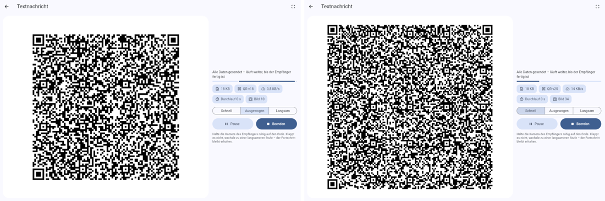
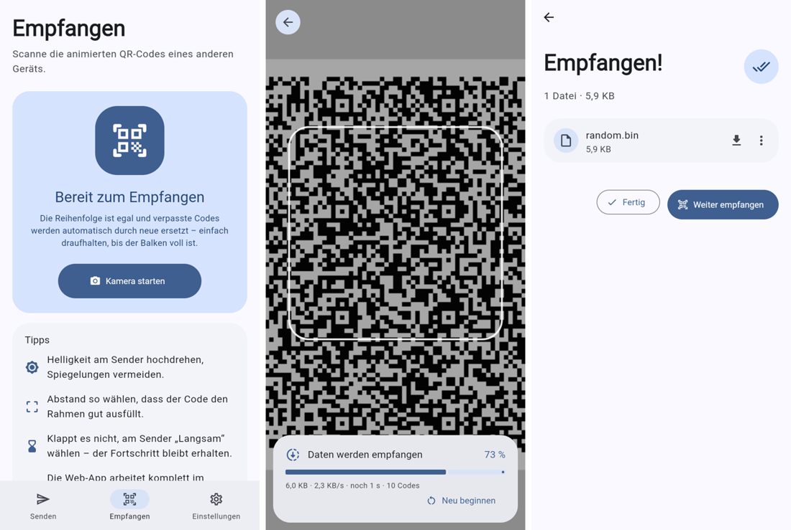

# InstantShare

Dateien und Text zwischen Laptop, Handy und Tablet teilen – über eine Folge sehr feiner,
wechselnder QR-Codes. Wie [LocalSend](https://localsend.org), nur ohne WLAN, ohne
Netzwerk und ohne Konto: Ein Gerät zeigt die Codes, das andere filmt sie mit der Kamera.

<p>
  
  
</p>

## Download

Alle Dateien liegen unter **[Releases](../../releases/latest)**:

| Plattform | Datei | Installation |
|---|---|---|
| Android 7+ (Handy, Tablet) | `InstantShare-<version>-android.apk` | APK öffnen, Installation aus unbekannten Quellen erlauben |
| Ubuntu 24.04 | `instantshare_<version>_amd64.deb` | `sudo apt install ./instantshare_<version>_amd64.deb` |
| Windows 10 / 11 | `InstantShare-<version>-windows-x64-setup.exe` | Installer starten (keine Admin-Rechte nötig) |
| Jeder Browser | Web-App | **https://endermen9932.github.io/instantShare/** |

Die **Web-App** kann alles, was die Apps können (senden *und* empfangen), läuft komplett im
Browser und braucht keinen Server. Einrichtung: [docs/GITHUB_PAGES.md](docs/GITHUB_PAGES.md).

> **Android:** Die APK ist wie gewünscht mit dem Android-**Debug-Schlüssel** signiert (kein
> eigener Keystore). GitHub Actions erzeugt bei jedem Build einen neuen Debug-Schlüssel,
> daher vor einem Update die alte Version deinstallieren.
>
> **Windows:** Der Installer ist nicht code-signiert; SmartScreen fragt evtl. nach
> („Weitere Informationen → Trotzdem ausführen“).

## Geschwindigkeitsstufen

| Stufe | QR-Code | Wechsel | Rohdaten | Gedacht für |
|---|---|---|---|---|
| **Schnell** | Version 25 (117 × 117 Module), Fehlerkorrektur L | 12 / s | ≈ 14,6 KB/s | scharfe Displays, gute Kameras |
| **Ausgewogen** | Version 18 (89 × 89), M | 7 / s | ≈ 3,5 KB/s | die meisten Geräte |
| **Langsam** | Version 10 (57 × 57), Q | 4 / s | ≈ 0,5 KB/s | schwache Displays, alte Geräte, schlechte Kameras |
| **Overclock** | einstellbar bis Version 40 (177 × 177), L, 1–3 Codes gleichzeitig | 5–60 / s | bis > 300 KB/s (Standard: 2 × v40 bei 20 / s ≈ 110 KB/s) | High-End-Handys und schnelle Laptops |

### Overclock

Overclock reizt aus, was Display und Kamera hergeben:

- **Dichte bis QR-Version 40** – 2,8 KB pro Code. Die App zeigt live an, wie viele Pixel ein
  Modul auf dem Display hat (≥ 4 px/Modul sind ideal).
- **Mehrere Codes gleichzeitig** nutzen die ganze Fläche: am Laptop nebeneinander, am Handy
  untereinander. Der Empfänger liest bis zu 4 Codes pro Kamerabild – Handy dabei quer halten.
- **Bis 60 Wechsel pro Sekunde.** Mehr als ~25/s bringt meist wenig, weil die Kamera dann
  Übergänge erwischt; dichtere Codes oder mehr Codes gleichzeitig skalieren besser.
- **Empfänger:** dekodiert parallel auf bis zu 4 CPU-Kernen; unter *Einstellungen → 60 fps
  Kamera* liest ein Handy doppelt so viele Bilder, falls die Kamera das kann.

Alle Werte lassen sich während der Übertragung ändern, ohne dass Fortschritt verloren geht.

Die Stufe lässt sich **während der Übertragung** wechseln, ohne dass der Empfänger etwas
verliert. Texte und Dokumente werden vorher komprimiert und sind dadurch meist deutlich
schneller.

## So funktioniert's

- **Fountain-Code:** Die Daten werden in 64-Byte-Symbole zerlegt. Zuerst werden alle
  Symbole einmal direkt gesendet, danach endlos zufällige XOR-Kombinationen
  (Random-Linear-Fountain über GF(2), Blöcke à 1024 Symbole). Der Empfänger braucht nur
  *irgendwelche* ≈ k + 1 % Symbole – Reihenfolge, verpasste oder doppelte Codes sind egal.
  Dekodiert wird per inkrementeller Gauß-Elimination.
- **QR-Codes im Alphanumerik-Modus:** Jedes Bild enthält Kopf (Transfer-ID, Länge,
  Sequenznummer), mehrere Symbole und eine CRC-32, kodiert in Base45 – das nutzt den
  dichten Alphanumerik-Modus und übersteht jeden QR-Leser unverändert.
- **Erkennung:** zxing-cpp – nativ über FFI (Android, Linux, Windows) bzw. als
  WebAssembly im Browser. Kamera über CameraX (Android), camera_desktop (GStreamer/V4L2
  unter Linux, Media Foundation unter Windows) bzw. `getUserMedia` im Browser.
- **Material 3:** gebaut mit Flutter 3.47 und dem neuen `material_ui`-Paket inkl.
  dynamischer Farben (Android 12+, Linux, Windows) und Material-3-Expressive-Elementen.

## Selbst bauen

Voraussetzung: [Flutter 3.47](https://docs.flutter.dev/get-started/install).

```bash
flutter pub get
flutter test
flutter run                     # Debug auf dem verbundenen Gerät
flutter build apk --release     # Android
flutter build linux --release   # Linux (benötigt libgtk-3-dev, libgstreamer1.0-dev,
                                #        libgstreamer-plugins-base1.0-dev)
flutter build windows --release # Windows (Visual Studio mit C++)
flutter build web --release --base-href /instantShare/
```

Pakete wie in CI: `packaging/linux/build_deb.sh`, `packaging/windows/installer.iss`
(Inno Setup). Icons neu erzeugen: `python3 tool/generate_icons.py`.

## Releases

`.github/workflows/build-and-release.yml` baut bei jedem Push auf `main` oder `claude/*`
alle Plattformen und veröffentlicht sie als Release `v<version>` (Version aus
`pubspec.yaml`). Für eine neue Version die Zeile `version:` in `pubspec.yaml` erhöhen.

## Lizenz

MIT – siehe [LICENSE](LICENSE). Die Web-App enthält
[zxing-wasm](https://github.com/Sec-ant/zxing-wasm) (MIT) mit zxing-cpp (Apache-2.0).
